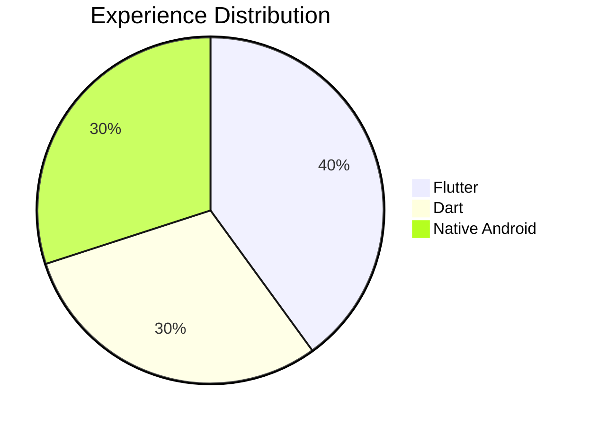
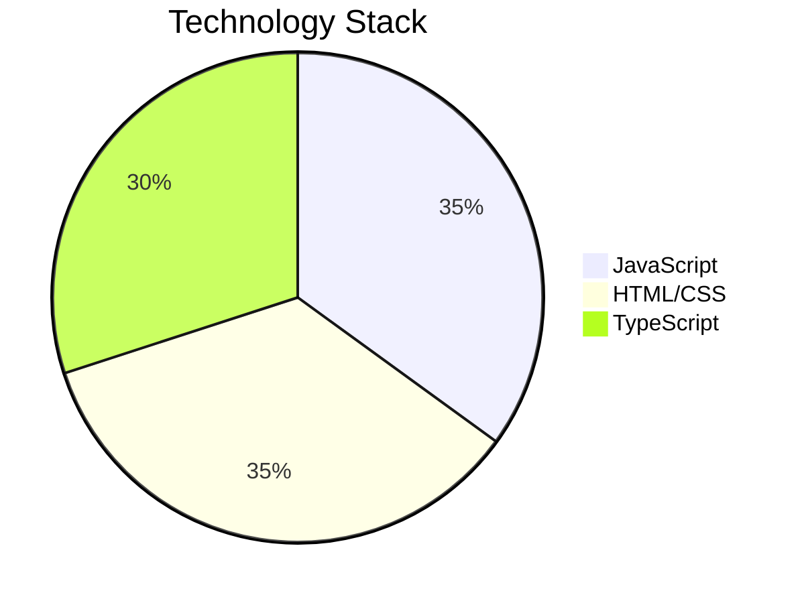

<div align="center">


[](https://github.com/Ayar-Suresh)

</div>


## 👨‍💻 Professional Overview
```typescript
interface Developer {
    name: string;
    role: string;
    languages: string[];
    expertise: string[];
    location: string;
}

const ayar: Developer = {
    name: "Ayar Suresh",
    role: "Senior Software Engineer",
    languages: ["Dart", "Python", "JavaScript", "TypeScript"],
    expertise: ["Flutter", "Web Development", "DevOps"],
    location: "Ahmedabad, India 🇮🇳"
};
```

<br clear="right"/>

## 🎯 Core Competencies

<div align="center">


### Development Expertise
<table>
<tr>
<td>

**Mobile Development** 


</td>
<td>

**Web Development**


</td>
</tr>
</table>

</div>

## 📊 Performance Metrics

<div align="center">


<table>
  <tr>
    <td width="50%">
      
    </td>
    <td width="50%">
      
    </td>
  </tr>
</table>

[](https://github.com/ashutosh00710/github-readme-activity-graph)

</div>

## 🎯 Featured Projects

<div align="center">
<table>
<tr>
<td width="50%">
<h3 align="center">WhatsApp Status Manager</h3>
<div align="center">
<a href="github.com/Ayar-Suresh" target="_blank"></a>
<p>
<a href="https://github.com/Ayar-Suresh" target="_blank">


</a>
</p>
<p><strong>Advanced WhatsApp status management solution with cloud integration and smart features</strong></p>
</div>
</td>
<td width="50%">
<h3 align="center">Construction Management Portal</h3>
<div align="center">
<a href="github.com/Ayar-Suresh" target="_blank"></a>
<p>
<a href="https://github.com/Ayar-Suresh" target="_blank">


</a>
</p>
<p><strong>Enterprise-grade construction project management system with real-time tracking</strong></p>
</div>
</td>
</tr>
</table>
</div>

## 🤝 Professional Network

<div align="center">

[](https://www.linkedin.com/in/ayar-suresh-itpro/)
[](https://yourportfolio.com)
[](https://wa.me/918320097437)

### 📫 Professional Contact
<details>
<summary><b>Connect With Me</b></summary>
<br>
📧 <b>Email:</b> ayar.suresh@example.com<br>
📱 <b>Business:</b> +91 8320097437<br>
🌐 <b>Website:</b> yourportfolio.com
</details>


### 📈 Profile Analytics


</div>
