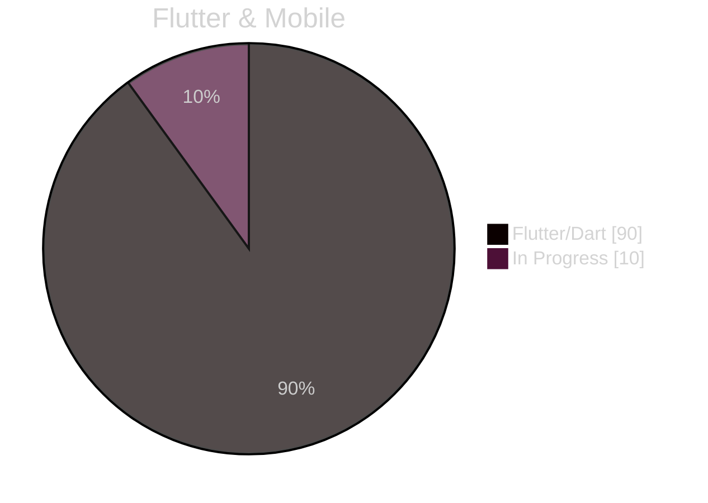
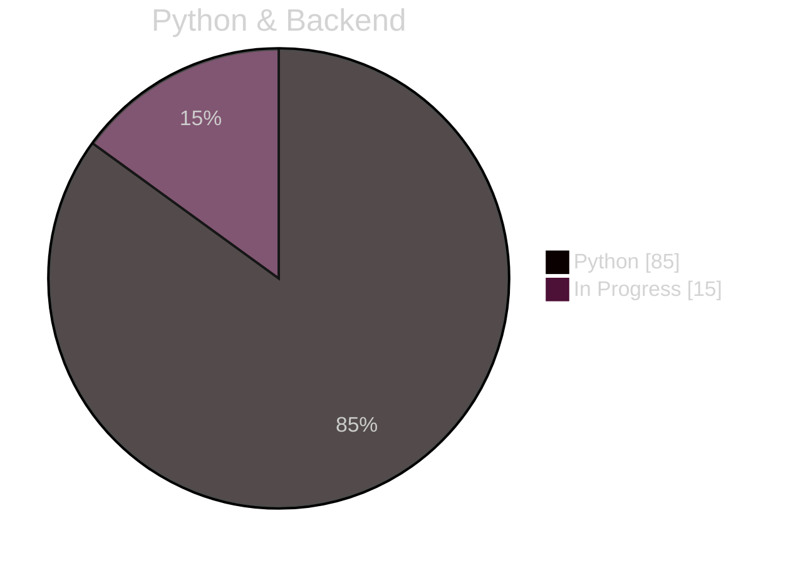

<div align="center">


[](https://github.com/Ayar-Suresh)

</div>

---

## 🎭 Who Am I?

```python
class AyarSuresh:
    def __init__(self):
        self.name = "Ayar Suresh"
        self.location = "Ahmedabad, India 🇮🇳"
        self.work = "Freelance Developer & Tech Innovator"
        self.skills = {
            "mobile": ["Flutter", "Dart", "Android"],
            "web": ["HTML5", "CSS3", "JavaScript"],
            "backend": ["Python", "Firebase"],
            "devops": ["Docker", "Git", "Linux"]
        }
        self.interests = ["🚀 Innovation", "🎮 Gaming", "📚 Learning"]
        
    def say_hi(self):
        print("Thanks for dropping by! Let's create something amazing together! 🤝")

me = AyarSuresh()
me.say_hi()
```

---

## 💫 Experience Level

<table>
<tr>
<td>



</td>
<td>



</td>
</tr>
</table>

### 🎯 Skills Progress


---

## 🛠️ Tech Arsenal

<div align="center">


### 📱 Mobile Development Expertise


### 🌐 Web Development Arsenal


### ⚡ Backend & Tools


</div>

---

## 📊 GitHub Statistics

<div align="center">


</div>

---

## 🤝 Connect & Collaborate

<div align="center">

[](https://www.linkedin.com/in/ayar-suresh-itpro/)
[](https://wa.me/918320097437)

</div>

---

## 🎵 Currently Vibing To

<div align="center">

[](https://open.spotify.com/user/31doy22mvycwt43tx6ajtqe7tdtu)

### 👀 Visitor Count


</div>
